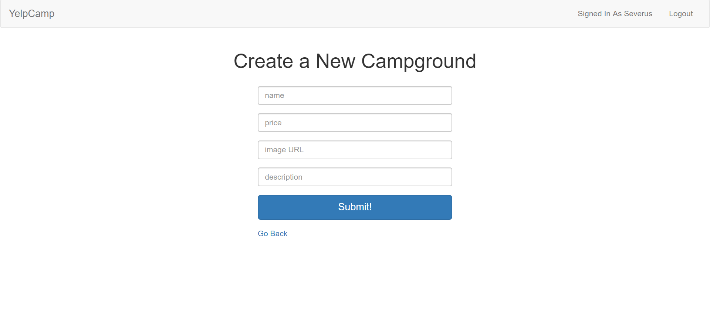

# YelpCamp

# Project Description

YelpCamp is an Express app that allows you to view campgrounds, as well as add comments to campgrounds, as long as you create an account and are logged in. You are also able to add your own campgrounds if you have an account.

This application uses Node.js and RESTful routes. All of the user's information persists using MongoDB as the database. Bootstrap is used for the design.

# Technologies Used

* Express.js
* Node.js
* Handlebars
* MySQL
* A homemade ORM
* AJAX/APIs
* jQuery
* Bootstrap
* CSS
* HTML

# YelpCamp Live Link

YelpCamp is deployed to Heroku. Please check it out here:

https://sleepy-journey-40253.herokuapp.com/

# Screenshots

